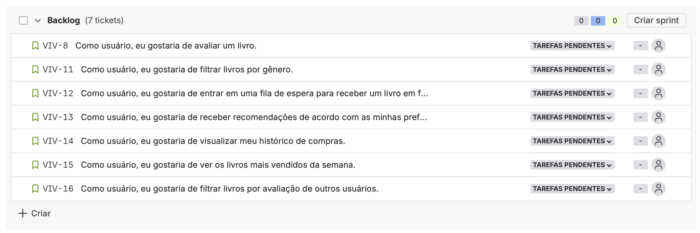

# VivArte

## Sobre o Projeto

O _**VivArte**_ é um site de vendas de livros e obras artísticas, no qual os usuários podem tanto expor suas criações, quanto adquirir desenhos de outros usuários. O projeto tem como principal intuito propagar a diversidade e a cultura através da arte.

## Entrega 1

### Histórias de Usuário

#### Quadro (sprint)

#### Backlog

- 👉 [Clique aqui para acessar o docs com as histórias](https://docs.google.com/document/d/1RLXJphhes-Kdtzw0TnwXNYpnUd-U_wLkc0-pWla9O64/edit?tab=t.0)

### Protótipo Lo-Fi VivArte

Criamos um protótipo de baixa fidelidade no Figma para representar a estrutura inicial do site VivArte.

- 👉 [Acesse o protótipo no Figma](https://www.figma.com/design/1wkZo2pTqCO0kfTdtsA6OL/VivArte?node-id=0-1&p=f&m=draw)
- 🎬 [Veja o vídeo explicativo do protótipo](https://youtu.be/6H9pklN93Cc)
