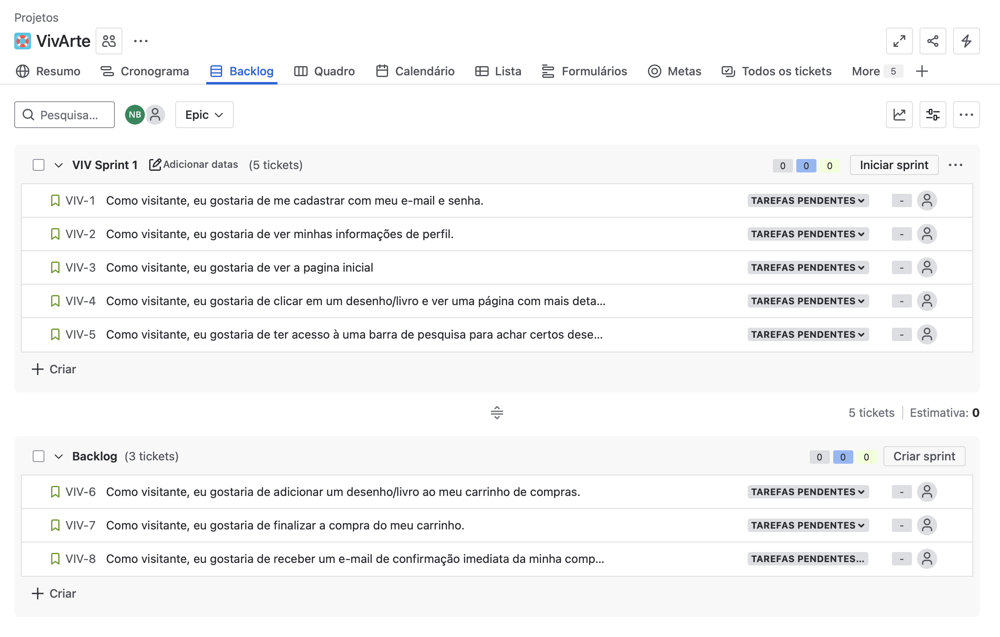

# VivArte

## Sobre o Projeto

O _**VivArte**_ é um site de vendas de livros e obras artísticas, no qual os usuários podem tanto expor suas criações, quanto adquirir desenhos de outros usuários. O projeto tem como principal intuito propagar a diversidade e a cultura através da arte.

## Entrega 1

### Histórias de Usuário

[Clique aqui para acessar o docs com as histórias](https://docs.google.com/document/d/1RLXJphhes-Kdtzw0TnwXNYpnUd-U_wLkc0-pWla9O64/edit?usp=sharing)

### Protótipo de Lo-Fi no Figma

[Clique para acessar mais informações](https://youtube.com)
