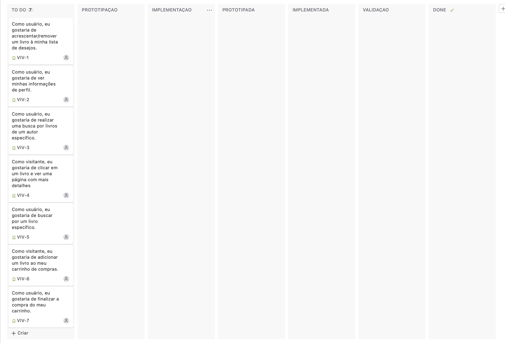
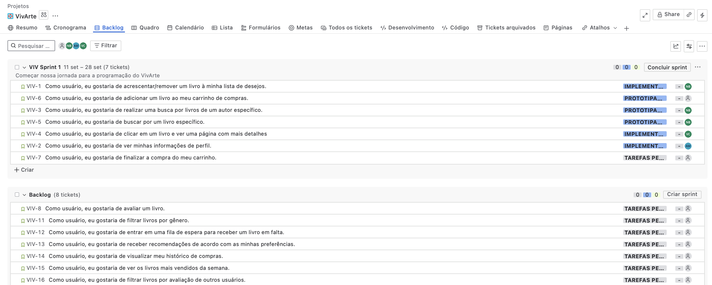
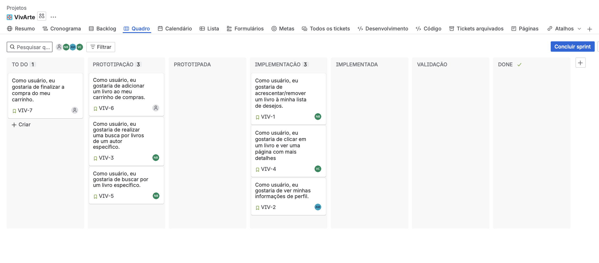
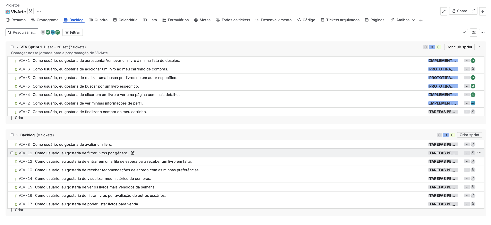
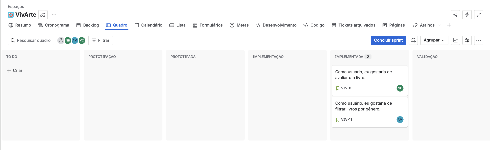
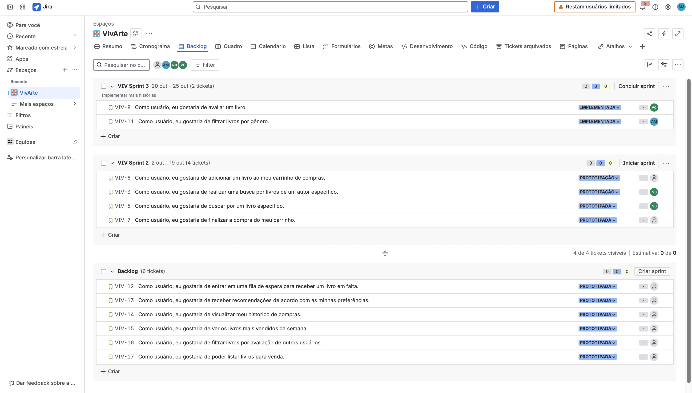

# VivArte

## Sobre o Projeto

O _**VivArte**_ é um site de vendas de livros, no qual os usuários podem tanto vender suas criações, quanto adquirir livros de outros escritores. O projeto tem como principal intuito propagar a diversidade e a cultura através da arte.

---

## Entrega 1

### Histórias de Usuário

#### Quadro (sprint)

#### Backlog

- 👉 [Clique aqui para acessar o docs com as histórias](https://docs.google.com/document/d/1RLXJphhes-Kdtzw0TnwXNYpnUd-U_wLkc0-pWla9O64/edit?tab=t.0)

### Protótipo Lo-Fi VivArte

Criamos um protótipo de baixa fidelidade no Figma para representar a estrutura inicial do site VivArte.

- 👉 [Acesse o protótipo no Figma](https://www.figma.com/design/1wkZo2pTqCO0kfTdtsA6OL/VivArte?node-id=0-1&p=f&m=draw)
- 🎬 [Veja o vídeo explicativo do protótipo](https://youtu.be/oX5jcyQ2it0?feature=shared)

---

## Entrega 2

### Histórias de Usuário 

#### Quadro (sprint)

#### Backlog

- 👉 [Clique aqui para acessar o docs com as histórias](https://docs.google.com/document/d/1RLXJphhes-Kdtzw0TnwXNYpnUd-U_wLkc0-pWla9O64/edit?tab=t.0)

#### Programação em Par experimentada

Neste tópico, documentamos a nossa experiência com a prática de Programação em Par. Para entender os detalhes, desafios e aprendizados obtidos durante o processo.

- 👉 [Clique aqui para acessar o relatório completo](https://docs.google.com/document/d/1M8ozVoiFYHHC7XLW48OckMtKpWRVdXbWguwumzyfgT8/edit?usp=sharing)

#### Screencast do Deploy das Histórias Implementadas

- 🎬 [Clique aqui para acessar o vídeo](https://youtu.be/tKdBd-vtArg)

## Entrega 3

### Histórias do Usuário

#### Quadro (sprint)

#### Backlog

- 👉 [Clique aqui para acessar o docs com as histórias](https://docs.google.com/document/d/1RLXJphhes-Kdtzw0TnwXNYpnUd-U_wLkc0-pWla9O64/edit?tab=t.0)

#### Programação em Par

Nesta entrega, damos continuidade à documentação em Par. Para mais detalhes, consulte a documentação completa disponível no docs.

- 👉 [Clique aqui para acessar o relatório completo](https://docs.google.com/document/d/1M8ozVoiFYHHC7XLW48OckMtKpWRVdXbWguwumzyfgT8/edit?usp=sharing)

#### Screencast do Deploy das Histórias Implementadas

- 🎬 [Clique aqui para acessar o vídeo](https://youtu.be/VrKWUx5uOKg?si=XlYa-4PaE0skhI0j)

#### Issue/bug tracker

#### Screencast do Deploy das Histórias Implementadas

#### Screencast do processo build e deployment automatizado

